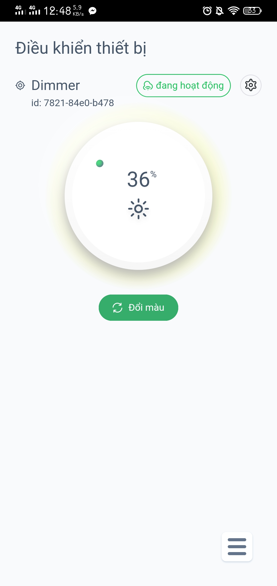
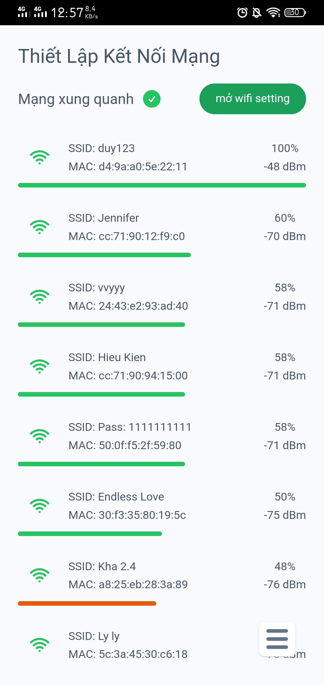
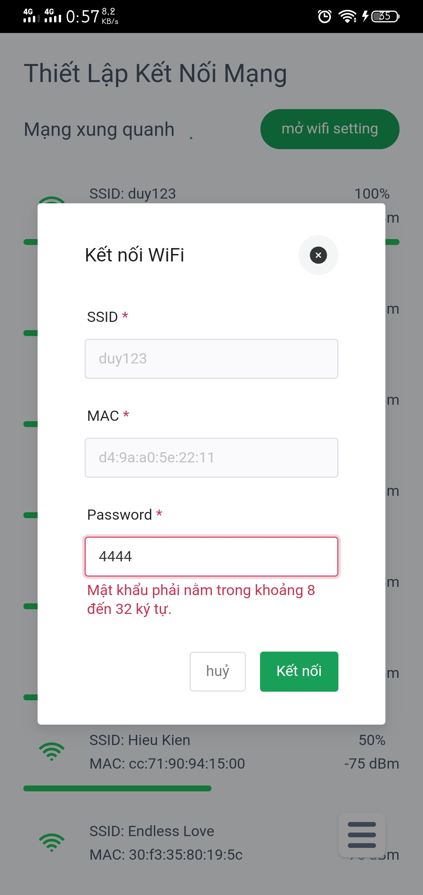
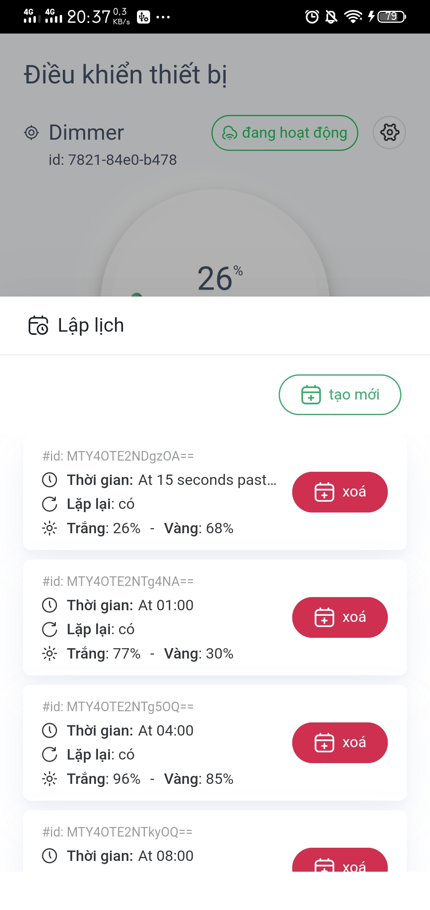
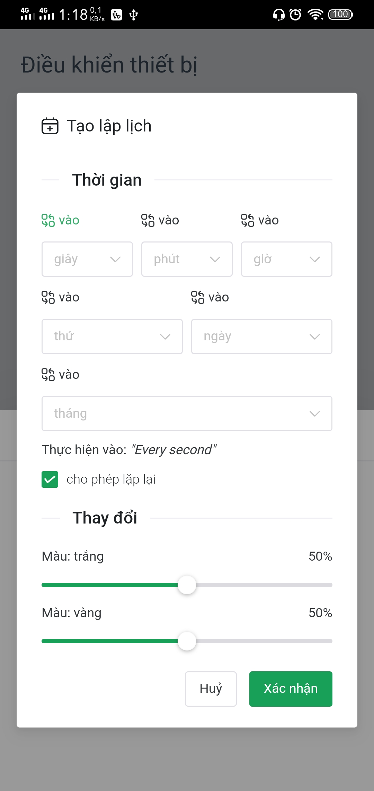
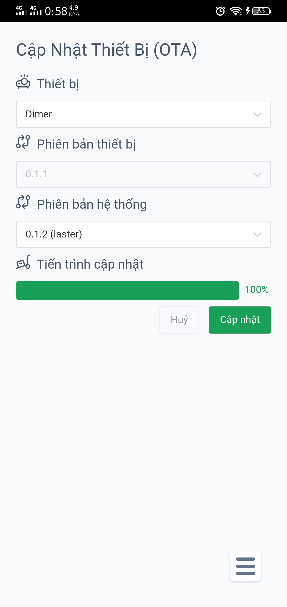
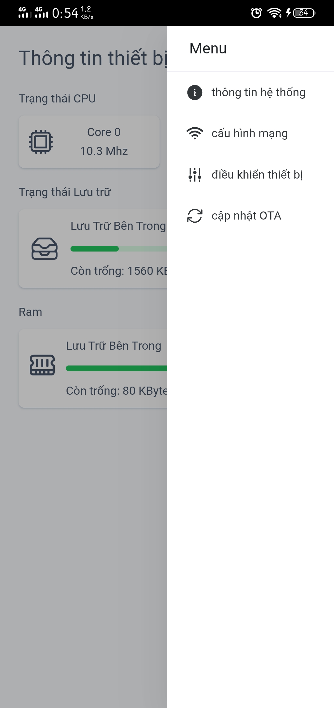
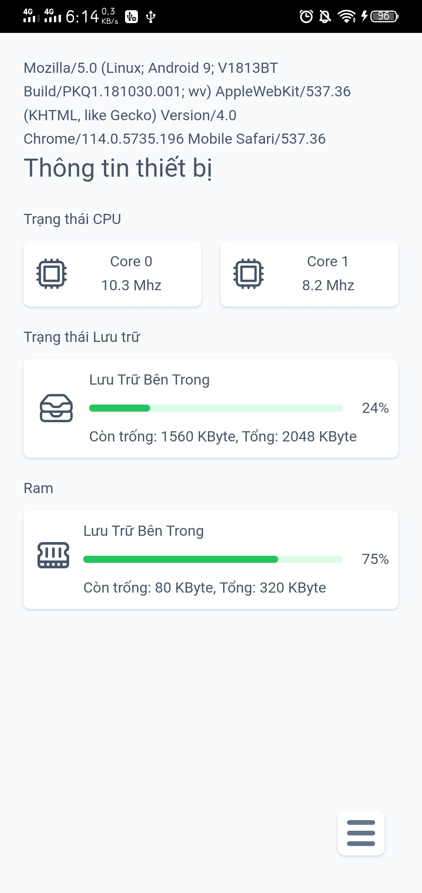

# Ứng dụng build Giao diện dành cho thiết bị phần cứng IOT Dimmer giúp điều chỉnh độ sáng đèn một cách thông minh
=> Bạn có thể tải về để test tại đây [(Tải xuống)](/apk/chat-gpt.apk)
## Giao diện điều khiển

  

## Cấu hình WiFi

  
  

## Lập lịch độ sáng

  
  

## Cập nhận phần cứng OTA

  

## Giao diện khác

  
  

